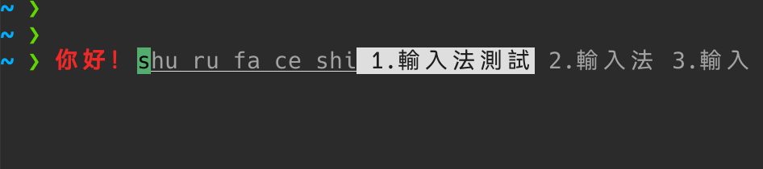

# tui-ime — 终端嵌入式中文输入法

[English](README.md) | **中文**

在终端里直接输入中文，无需 ibus/fcitx/XIM。headless 服务器、SSH 远程可用，
开不开 tmux 都行。

Rime 引擎嵌在 PTY proxy 后面：按键被拦截后交给 librime 组合，候选以 inline
条带形式渲染在光标处——底下的 shell 完全无感知。

## 截图



输入 `shurufaceshi` 时光标处显示下划线 preedit + 单行候选条
（`1.輸入法測試 2.輸入法 3.輸入`）；左侧红色的 `你好！` 是已经直接上屏到
shell 提示符里的内容。

## 架构（Phase 3）

```
tui-ime (proxy) ──Unix socket──► tui-ime-daemon (librime)
     │                                ▲
     │  按键拦截 / IME 渲染           │  Unix socket
     ▼                                │
 PTY slave ──► zsh/bash              tui-ime-popup (候选窗骨架)
（外层可为裸终端或 tmux）
```

- **daemon**：systemd user service，单例运行。管理 librime 生命周期 +
  session pool + IPC 服务。
- **proxy**：每终端会话一个实例。PTY 拦截 → CSI u 解析 → daemon IPC →
  inline ANSI 渲染。
- **popup**：tmux `display-popup` 候选窗（Phase 3 骨架，Phase 4 完善交互）。

## 技术栈

| 层 | 技术 |
|---|---|
| 键盘协议 | Kitty keyboard protocol（WezTerm 内置） |
| 候选窗 | tmux `display-popup` |
| 输入引擎 | librime（Rime，C API） |
| PTY 管理 | Rust `portable-pty` |
| 实现语言 | Rust |

**目标环境**：WezTerm + zsh/bash + Linux，可选 tmux。其他 kitty protocol
终端（kitty / foot / Ghostty / Alacritty）可按需适配；不支持
xterm / urxvt / Linux console。

## 快速开始

```bash
# 1. 安装依赖
sudo apt install librime-dev libclang-dev rime-data-luna-pinyin

# 2. 编译并安装二进制
cargo build --release
install -Dm755 target/release/tui-ime-daemon ~/.local/bin/tui-ime-daemon
install -Dm755 target/release/tui-ime ~/.local/bin/tui-ime

# 3. 安装并启动 daemon（systemd user service：登录自启 + 崩溃自动重启）
install -Dm644 tui-ime-daemon.service ~/.config/systemd/user/tui-ime-daemon.service
systemctl --user daemon-reload
systemctl --user enable --now tui-ime-daemon

# 4. 让交互式 shell 自动进入 proxy（与 tmux 解耦，开不开 tmux 都生效）
#    在 ~/.zshrc 末尾追加（exec 之后的内容不会执行，务必放最后）：
cat >> ~/.zshrc <<'EOF'

# tui-ime: 终端嵌入式中文输入法（daemon 由 systemd --user 托管）
if [[ -o interactive && -z "$TUI_IME_ACTIVE" \
   && -S "${XDG_RUNTIME_DIR:-$HOME/.local/share}/tui-ime/daemon.sock" \
   && -x "$HOME/.local/bin/tui-ime" ]]; then
  exec "$HOME/.local/bin/tui-ime"
fi
EOF

# 用 bash 则加到 ~/.bashrc，交互判断换成：[[ $- == *i* ]]
# 也可以不改动 shell 配置，需要时手动运行 tui-ime

# 默认切换键：Ctrl+\（不冲突系统输入法）
# 输入时光标处显示淡色 preedit + 单行候选条
```

守卫说明：`TUI_IME_ACTIVE` 由 proxy 注入，防止嵌套包裹（proxy 里再开 shell
会直接跳过）；socket / 二进制不存在时回退到普通 shell。

daemon 未运行时 proxy 会静默降级为纯透传（toggle 无效）。排查：

```bash
systemctl --user status tui-ime-daemon   # 应为 active (running)
ls /run/user/$UID/tui-ime/daemon.sock    # socket 应存在
```

## 切换键配置

默认 `Ctrl+\`（codepoint=92，modifiers=5 即 Ctrl）。如需改为 `Ctrl+Space`
或其他键：

```bash
# 环境变量方式（立即生效）
TUI_IME_TOGGLE=32:5 tui-ime   # Ctrl+Space
TUI_IME_TOGGLE=96:5 tui-ime   # Ctrl+`

# 配置文件方式（~/.config/tui-ime/tui-ime.toml）
[proxy]
toggle_codepoint = 32   # Space
toggle_modifiers = 5    # Ctrl（Kitty 编码 = bitmask + 1；Ctrl=5, Alt=3, Shift=2）
```

modifiers 使用 Kitty keyboard protocol 的原始编码值（实际修饰键 bitmask + 1）。
常用值：无修饰=1，Shift=2，Alt=3，Ctrl=5，Ctrl+Shift=7。

## tmux 内使用的额外要求（不开 tmux 可忽略）

裸终端下 proxy 直接和 WezTerm 协商扩展按键，无需任何配置。在 tmux 里使用时，
需要让 tmux 透传并转译扩展按键（`~/.tmux.conf`）：

```tmux
set -s -g extended-keys on                          # 窗格侧扩展按键（server 选项）
set -g extended-keys-format csi-u                   # 以 CSI u 格式上报
set -as terminal-features ",xterm-256color:extkeys" # 声明外层终端支持扩展按键
```

改完需 detach + reattach 生效（`extended-keys always` 可替代第三行）。

## 仓库结构

```
tui-ime/
├── README.md              ← English version
├── README_zh.md           ← 你在这里
├── AGENTS.md              ← AI agent 工作规范
├── STATUS.md              ← 当前项目状态
├── tui-ime-daemon.service ← systemd user service
├── screenshot/            ← 使用截图
├── docs/reports/          ← 分析报告（不进 git）
├── thirdpart/             ← 上游仓库本地参考（不进 git）
└── src/
    ├── lib.rs             ← library root
    ├── protocol.rs        ← IPC 消息类型
    ├── ipc.rs             ← Unix socket 传输层
    ├── config.rs          ← tui-ime.toml 加载
    ├── daemon.rs          ← session pool + 消息分发
    ├── ime.rs             ← librime 会话封装
    ├── keyevent.rs        ← CSI u / SS3 / modifyOtherKeys 解析
    ├── keymap.rs          ← 按键 → rime keycode 映射
    ├── proxy.rs           ← PTY proxy 核心
    ├── render.rs          ← inline ANSI 候选条
    ├── main.rs            ← tui-ime（proxy）入口
    └── bin/
        ├── daemon.rs      ← tui-ime-daemon 入口
        └── popup.rs       ← tui-ime-popup 入口（骨架）
```
